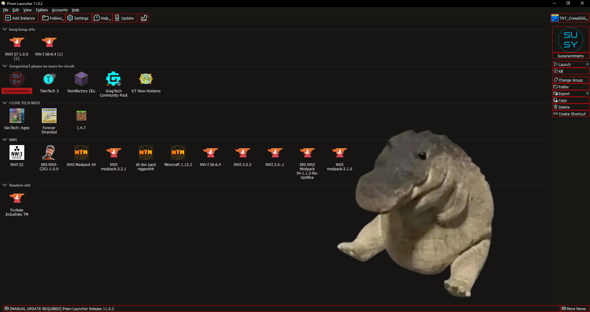
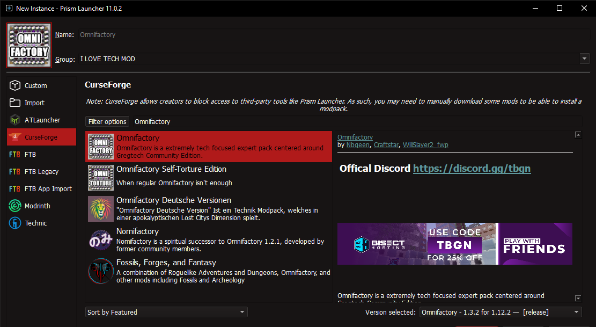
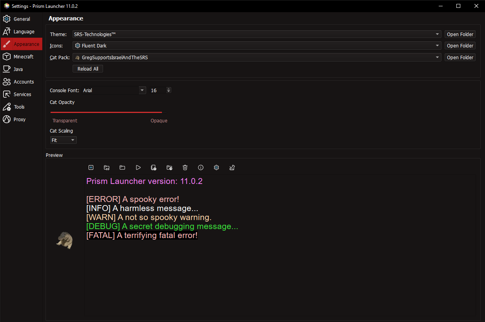
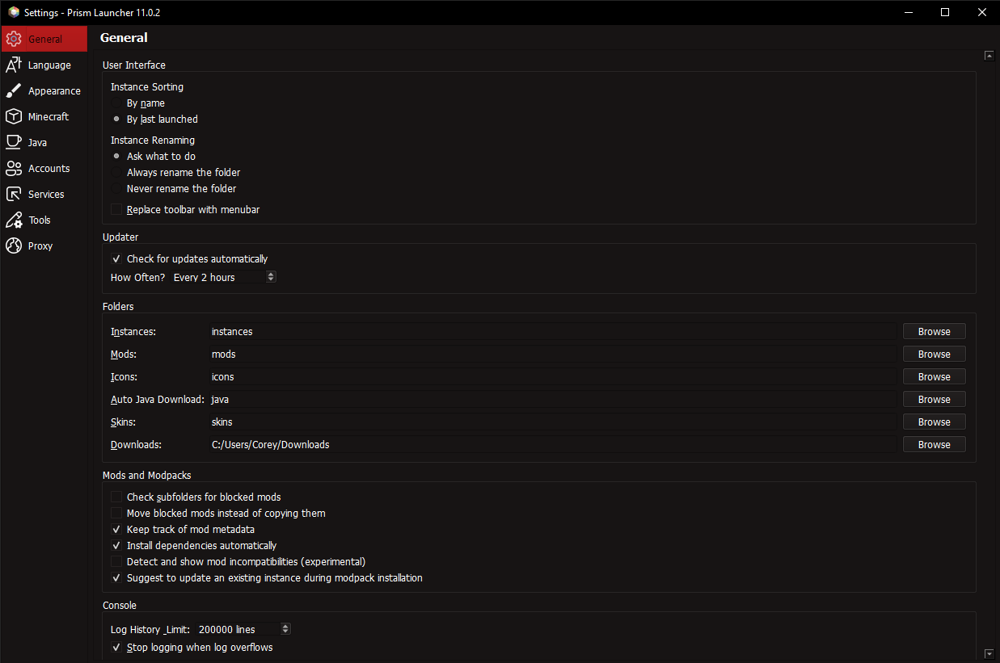
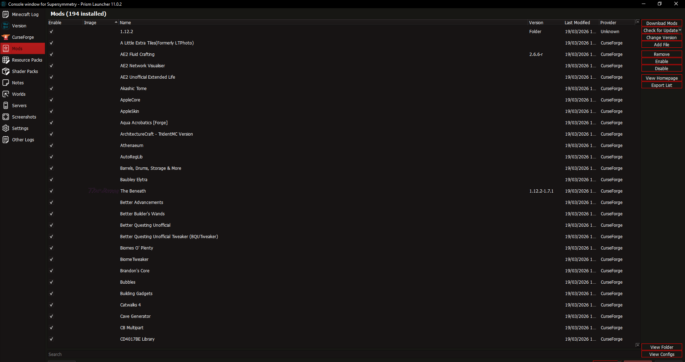

<h1 align="center"> SRS-Technologies-PrismLauncher

<h2 align="center">Peakest of peak

  

  

 

------------------------------------------------------------------------------------------------------------------

<h1 align="center">Showcase</h1>

  

<h1 align="center"> Main Menu

  

 

<h1 align="center"> Instance Creator

  

<h1 align="center"> Settings | Appearance

 

  

<h1 align="center"> Settings | General

  

 

<h1 align="center"> Mods Viewer | Supersymmetry

  

   

------------------------------------------------------------------------------------------------------------------

# How 2 install for dummies

locate prismlauncher.exe

exert force on left mouse button on prismlauncher.exe

locate the "Settings" part in the prism launcher program

exert force on left mouse button over the Settings part

locate tab where themes are located and exert force on left mouse after hovering over "Open Folder"

move your zip to the newly opened folder and exert force on right mouse button and then exert force on left mouse button and unzip it

return to themes and exert force on left mouse on the newly created "SRS-Technologies™"

exert force on left mouse over refresh and be happy

------------------------------------------------------------------------------------------------------------------

fuck you if you genuinely cant do this you incompetent fuck

------------------------------------------------------------------------------------------------------------------

# Additional Information

- Icons used in the showcase is Fluent Dark and is available in the community icons and themes repository for prism launcher along with others :D

- Greg not included
